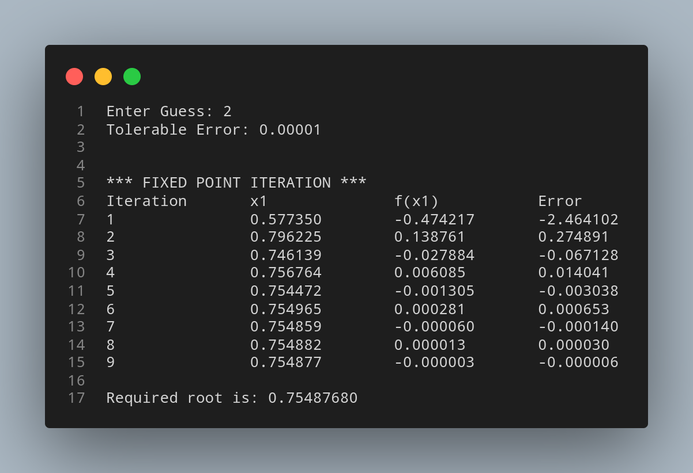

# Fixed Point Iteration Method

## Algorithm

    1. Start 

    2. Define function f(x)
    
    3. Define function g(x) which is obtained from f(x)=0 such that x = g(x) and |g'(x) < 1|

    4. Choose initial guess x0, Tolerable Error e

    5. Initialize iteration counter: step = 1

    6. Calculate x1 = g(x0)

    7. Increment iteration counter: step = step + 1 

    8. Set x0 = x1 for next iteration

    9. If |f(x1)| > e then goto step (6) otherwise goto step (10)

    10. Display x1 as root.

    11. Stop

## Source Code

``` python
# Importing math to use sqrt function
import math

def f(x):
    return x*x*x + x*x -1

# Re-writing f(x)=0 to x = g(x)
def g(x):
    return 1/math.sqrt(1+x)

# Implementing Fixed Point Iteration Method
def fixedPointIteration(x0, e):
    print('\n\n*** FIXED POINT ITERATION ***')
    step = 1
    flag = 1
    condition = True
    print('Iteration\tx1\t\tf(x1)\t\tError')
    while condition:
        x1 = g(x0)
        err = (x1 - x0)/x1
        print('%d\t\t%0.6f\t%0.6f\t%0.6f'%(step, x1, f(x1), err))
        
        x0 = x1

        step += 1
        
        condition = abs(f(x1)) > e

    if flag==1:
        print('\nRequired root is: %0.8f' % x1)
    else:
        print('\nNot Convergent.')

# Input Section
x0 = float(input('Enter Guess: '))
e = float(input('Tolerable Error: '))

# Starting Newton Raphson Method
fixedPointIteration(x0,e)
```

## Output



## Link

[Fixed Point Iteration Method](https://github.com/kabirdeula/Numerical_Method_Lab_Report/blob/main/Lab%20Report/Lab04.py)

[Back to Home](README.md)