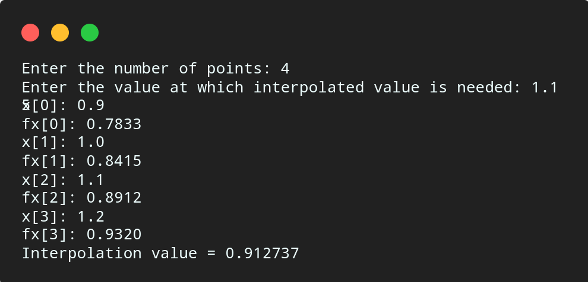

# Newton Backward Difference

## Algorithm

    1. Start

    2. Read number of points, say n.
    
    3. Enter the value at which interpolated value is required, say xp.

    4. Read n data points.

    5. Set h = x[1] - x[0] and s = (xp - x[n - 1]) / h.

    6. Calculate first backward difference as below,

        For i = 0 to n - 1
            bd[i] = fx[i]
        End For

    7. Calculate 2nd to nth backward differences as below,

        For i = n - 1 to 1
            For j = 0 to i - 1
                bd[j] = bd[j + 1] - bd[j]
            End For
            Set v = bd[n - 1]
        End For
    
    8. Calculate interpolated value as below,

        For i = 1 to n - 1
            For k = 1 to i
                p = p * (s + k - 1)
            End For
            v = v + (bd[n - i - 1] * p)/ fact(i)
            Reset p = 1
        End For
    
    9. Print interpolated value v at xp

    10. Stop

## Source Code

``` c

#include<stdio.h>

int fact(int n){
    if (n == 1){
        return 1;
    }else {
        return (n * fact(n - 1));
    }
}

int main(){
    int n, i, j, k;
    float v = 0, p, xp, x[10], fx[10], bd[10], h, s;
    
    printf("Enter the number of points: ");
    scanf("%d", &n);
    
    printf("Enter the value at which interpolated value is needed: ");
    scanf("%f", &xp);
    
    for (i = 0; i < n; i++){
        printf("x[%d]: ",i);
        scanf("%f", &x[i]);
        printf("fx[%d]: ",i);
        scanf("%f",&fx[i]);
    }

    h = x[1] - x[0];
    s = (xp - x[n - 1]) / h;

    for (i = 0; i < n; i++){
        bd[i] = fx[i];
    }

    for (i = n - 1; i > 0; i--){
        for (j = 0; j < i; j++){
            bd[j] = (bd[j + 1] - bd[j]);
        }
    }
    v = bd[n - 1];

    for (i = 1; i < n; i++){
        p = 1;
        for (k = 1; k <= i; k++){
            p = p * (s + k - 1);
        }
        v = v + (bd[n - i - 1] * p) / fact(i);
    }

    printf("Interpolation value = %f\n", v);
    return 0;

}

```

## Output



## Links

[Newton's Backward Difference](https://github.com/kabirdeula/Numerical_Method_Lab_Report/blob/main/Lab%20Report/Lab08.c)

[Back to Home](README.md)
