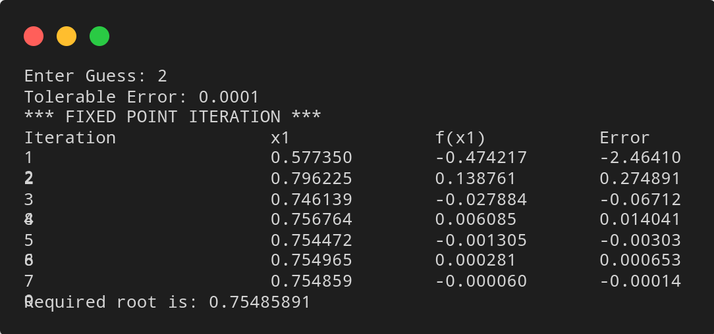

# Newton Raphson Method

## Algorithm

    1. Start

    2. Define function as f(x)

    3. Define first derivative of f(x) as g(x)

    4. Input initial guess (x0), tolerable error (e) 

    5. Initialize iteration counter i = 1

    6. If g(x0) = 0 then print "Mathematical Error" and goto (11) otherwise goto (7) 

    7. Calcualte x1 = x0 - f(x0) / g(x0)

    8. Increment iteration counter i = i + 1

    9. If |f(x1)| > e then set x0 = x1 and goto (6) otherwise goto (11)

    10. Print root as x1

    11. Stop

## Source Code

``` python
# Defining Function
def f(x):
    return x**3 - 5*x - 9

# Defining derivative of function
def g(x):
    return 3*x**2 - 5

# Implementing Newton Raphson Method
def newtonRaphson(x0,e):
    print('\n\n*** NEWTON RAPHSON METHOD IMPLEMENTATION ***')
    step = 1
    flag = 1
    condition = True
    print('Iteration\t\tx1\t\tf(x1)\t\tError')
    while condition:
        if g(x0) == 0.0:
            print('Divide by zero error!')
            break
        
        x1 = x0 - f(x0)/g(x0)
        err = (x1 - x0)/x1
        print('%d\t\t%0.6f\t%0.6f\t\t%0.6f'%(step, x1, f(x1), err))
        
        x0 = x1
        step = step + 1
        
        condition = abs(f(x1)) > e
    
    if flag==1:
        print('\nRequired root is: %0.8f' % x1)
    else:
        print('\nNot Convergent.')

#Note: You can combine above three section like this
x0 = float(input('Enter Guess: '))
e = float(input('Tolerable Error: '))

# Starting Newton Raphson Method
newtonRaphson(x0,e)
```

## Output



## Link

[Newton Raphson Method](https://github.com/kabirdeula/Numerical_Method_Lab_Report/blob/main/Lab%20Report/Lab3-NewtonRaphsonMethod.py)

[Back to Home](README.md)
