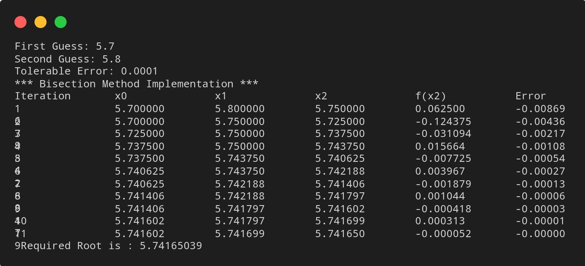
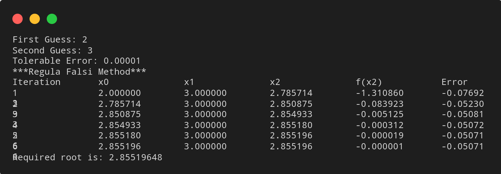
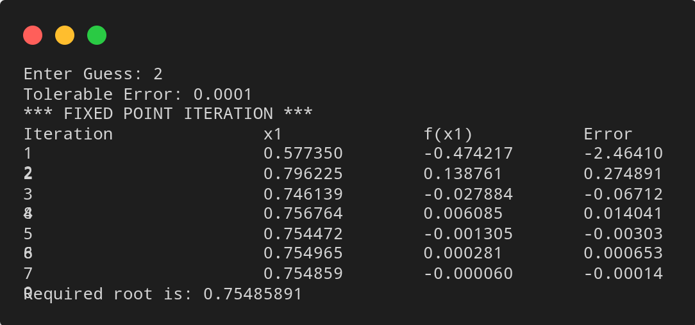
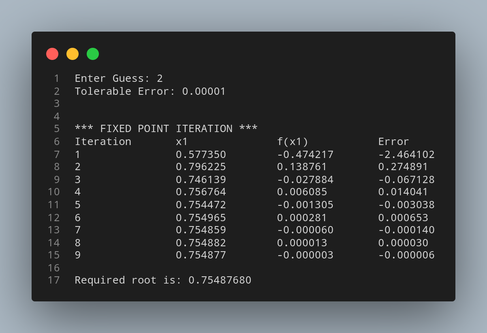
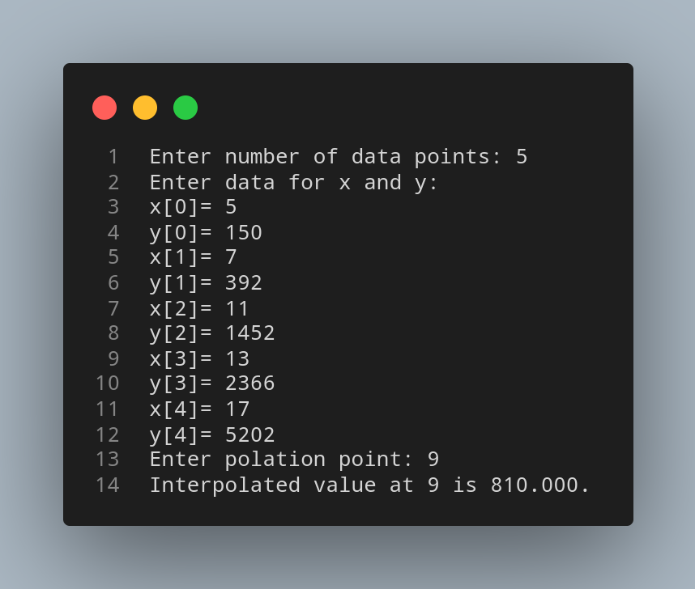
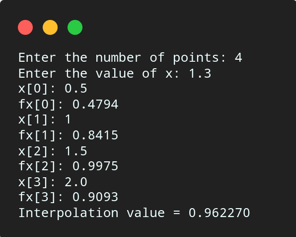

# Numerical Method Lab Report

This is a Numerical Method Lab Report made using Python.

# Table of Contents

- [Overview](#overview)
    - [Bisection Method](#bisection-method)
    - [False Position Method](#false-position-method)
    - [Newton Raphson Method](#newton-raphson-method)
    - [Fixed Point Iteration Method](#fixed-point-iteration-method)
    - [Lagrange Interpolation Method](#lagrange-interpolation-method)
    - [Newton Divided Difference](#newton-divided-difference)
- [My Process](#my-process)
- [Author](#author)

# Overview

## Bisection Method

### Algorithm

    1. Start

    2. Define function f(x)

    3. Choose initial guesses x0 and x1 such that f(x0)f(x1) < 0

    4. Choose pre-specified tolerable error e.

    5. Calculate new approximated root as x2 = (x0 + x1)/2

    6. Calculate f(x0)f(x2)
	    a. If f(x0)f(x2) < 0 then x0 = x0 and x1 = x2
	    b. If f(x0)f(x2) > 0 then x0 = x2 and x1 = x1
	    c. If f(x0)f(x2) = 0 then goto (8)
	
    7. If |f(x2)| > e then goto (5) otherwise goto (8)

    8. Display x2 as root.

    9. Stop

### Source Code

``` python 
# Defining equation
def f(x):
    return x**2-4*x-10

# Implementing Bisection method
def bisection(x0,x1,e):
    step = 1
    print("\n\n*** Bisection Method Implementation ***")
    condition = True
    print('Iteration\tx0\t\tx1\t\tx2\t\tf(x2)\t\tError')
    while condition:
        x2 = (x0 + x1)/2
        err = (x2 - x1)/x2
        print('%d\t\t%0.6f\t%0.6f\t%0.6f\t%0.6f\t%0.6f'%(step, x0, x1,x2, f(x2), err))

        if f(x0) * f(x2) < 0:
            x1 = x2
        else:
            x0 = x2

        step += 1
        condition = abs(f(x2)) > e
    
    print("\n Required Root is : %0.8f" % x2)

# Input Section
x0 = float(input('First Guess: '))
x1 = float(input('Second Guess: '))
e = float(input('Tolerable Error: '))

# Checking correctness of initial guess values and bisecting
if f(x0) * f(x1) > 0.0:
    print('Given guess values do not bracket the root.\nTry again with different guess values')
else:
    bisection(x0,x1,e)
```

### Output



### Link

[Bisection Method](https://github.com/kabirdeula/Numerical_Method_Lab_Report/blob/main/Lab%20Report/Lab1-BisectionMethod.py)

[Back to Top](#table-of-contents)

## False Position Method

### Algorithm

    1. Start

    2. Define function f(x)

    3. Choose initial guesses x0 and x1 such that f(x0)f(x1) < 0

    4. Choose pre-specified tolerable error e.

    5. Calculate new approximated root as: 
    
       x2 = x0 - ((x0-x1) * f(x0))/(f(x0) - f(x1))

    6. Calculate f(x0)f(x2)
    	a. if f(x0)f(x2) < 0 then x0 = x0 and x1 = x2
    	b. if f(x0)f(x2) > 0 then x0 = x2 and x1 = x1
    	c. if f(x0)f(x2) = 0 then goto (8)
    
    7. If |f(x2)|>e then goto (5) otherwise goto (8)

    8. Display x2 as root.

    9. Stop

### Source Code

``` python
# Defining equation
def f(x):
    return x**3-5*x-9

# Implementing Regula Falsi Method
def falsi(x0,x1,e):
    step=1
    print("\n\n***Regula Falsi Method***\n\n")
    condition = True
    print('Iteration\tx0\t\tx1\t\tx2\t\tf(x2)\t\tError')

    while condition:
        x2 = x0 - (x1-x0) * f(x0)/( f(x1) - f(x0))
        err = (x2 - x1)/x2
        print('%d\t\t%0.6f\t%0.6f\t%0.6f\t%0.6f\t%0.6f'%(step, x0, x1,x2, f(x2), err))

        if f(x0) * f(x2) < 0:
            x1 = x2
        else:
            x0 = x2

        step = step + 1
        condition = abs(f(x2)) > e

    print('\nRequired root is: %0.8f' % x2)

# Input Section
x0 = float(input('First Guess: '))
x1 = float(input('Second Guess: '))
e = float(input('Tolerable Error: '))

# Checking Correctness of initial guess values and false positioning
if f(x0) * f(x1) > 0.0:
    print('Given guess values do not bracket the root.')
    print('Try Again with different guess values.')
else:
    falsi(x0,x1,e)

```

### Output



### Link

[False Position Method](https://github.com/kabirdeula/Numerical_Method_Lab_Report/blob/main/Lab%20Report/Lab2-FalsePositionMethod.py)

[Back to Top](#table-of-contents)

## Newton Raphson Method

### Algorithm

    1. Start

    2. Define function as f(x)

    3. Define first derivative of f(x) as g(x)

    4. Input initial guess (x0), tolerable error (e) 

    5. Initialize iteration counter i = 1

    6. If g(x0) = 0 then print "Mathematical Error" and goto (11) otherwise goto (7) 

    7. Calcualte x1 = x0 - f(x0) / g(x0)

    8. Increment iteration counter i = i + 1

    9. If |f(x1)| > e then set x0 = x1 and goto (6) otherwise goto (11)

    10. Print root as x1

    11. Stop

### Source Code

``` python
# Defining Function
def f(x):
    return x**3 - 5*x - 9

# Defining derivative of function
def g(x):
    return 3*x**2 - 5

# Implementing Newton Raphson Method
def newtonRaphson(x0,e):
    print('\n\n*** NEWTON RAPHSON METHOD IMPLEMENTATION ***')
    step = 1
    flag = 1
    condition = True
    print('Iteration\t\tx1\t\tf(x1)\t\tError')
    while condition:
        if g(x0) == 0.0:
            print('Divide by zero error!')
            break
        
        x1 = x0 - f(x0)/g(x0)
        err = (x1 - x0)/x1
        print('%d\t\t%0.6f\t%0.6f\t\t%0.6f'%(step, x1, f(x1), err))
        
        x0 = x1
        step = step + 1
        
        condition = abs(f(x1)) > e
    
    if flag==1:
        print('\nRequired root is: %0.8f' % x1)
    else:
        print('\nNot Convergent.')

#Note: You can combine above three section like this
x0 = float(input('Enter Guess: '))
e = float(input('Tolerable Error: '))

# Starting Newton Raphson Method
newtonRaphson(x0,e)
```

### Output



### Link

[Newton Raphson Method](https://github.com/kabirdeula/Numerical_Method_Lab_Report/blob/main/Lab%20Report/Lab3-NewtonRaphsonMethod.py)

[Back to Top](#table-of-contents)

## Fixed Point Iteration Method

### Algorithm

    1. Start 

    2. Define function f(x)
    
    3. Define function g(x) which is obtained from f(x)=0 such that x = g(x) and |g'(x) < 1|

    4. Choose initial guess x0, Tolerable Error e

    5. Initialize iteration counter: step = 1

    6. Calculate x1 = g(x0)

    7. Increment iteration counter: step = step + 1 

    8. Set x0 = x1 for next iteration

    9. If |f(x1)| > e then goto step (6) otherwise goto step (10)

    10. Display x1 as root.

    11. Stop

### Source Code

``` python
# Importing math to use sqrt function
import math

def f(x):
    return x*x*x + x*x -1

# Re-writing f(x)=0 to x = g(x)
def g(x):
    return 1/math.sqrt(1+x)

# Implementing Fixed Point Iteration Method
def fixedPointIteration(x0, e):
    print('\n\n*** FIXED POINT ITERATION ***')
    step = 1
    flag = 1
    condition = True
    print('Iteration\tx1\t\tf(x1)\t\tError')
    while condition:
        x1 = g(x0)
        err = (x1 - x0)/x1
        print('%d\t\t%0.6f\t%0.6f\t%0.6f'%(step, x1, f(x1), err))
        
        x0 = x1

        step += 1
        
        condition = abs(f(x1)) > e

    if flag==1:
        print('\nRequired root is: %0.8f' % x1)
    else:
        print('\nNot Convergent.')

# Input Section
x0 = float(input('Enter Guess: '))
e = float(input('Tolerable Error: '))

# Starting Newton Raphson Method
fixedPointIteration(x0,e)
```

### Output



### Link

[Fixed Point Iteration Method](https://github.com/kabirdeula/Numerical_Method_Lab_Report/blob/main/Lab%20Report/Lab4-FixedPointIterationMethod.py)

[Back to Top](#table-of-contents)

## Lagrange Interpolation Method

### Algorithm

    1. Start

    2. Read number of data (n)

    3. Read data X<sub>i</sub> and Y<sub>i</sub> for i = 1 to n

    4. Read value of independent variables say xp whose corresponding value of dependent say yp is to be determined.

    5. Initialize: yp = 0

    6. For i = 1 to n
        Set p = 1
        For j = 1 to n
            If i != j then
                Calculate p = p * (xp - X<sub>j</sub>)/(X<sub>i</sub> - X<sub>j</sub>)
            End if
        Next j
        Calculate yp = yp + p * Y<sub>i</sub>
       Next i
    
    7. Display value of yp as interpolated value.

    8. Stop

### Source Code

``` python
# Importing NumPy Library
import numpy as np

# Reading number of unknowns
n = int(input('Enter number of data points: '))

# Making numpy array of n & n x n size and initializing 
# to zero for storing x and y value along with difference of y
x = np.zeros((n))
y = np.zeros((n))

# Reading data points
print('Enter data for x and y: ')
for i in range(n):
  x[i] = float(input( 'x['+str(i)+']='))
  y[i] = float(input( 'y['+str(i)+']='))

# Reading interpolation point 
xp = float(input('Enter polation point: '))

# Set interpolated value initially to zero
yp = 0

# Implementing Lagrange Interpolation
for i in range(n):
  p = 1
  for j in range(n):
    if i != j:
      p = p*(xp - x[j])/(x[i] - x[j])
    
  yp = yp +p * y[i]

# Displaying output
print('Interpolated value at %.3f is %.3f.'%(xp,yp))
```

### Output



### Link

[Lagrange Interpolation Method](https://github.com/kabirdeula/Numerical_Method_Lab_Report/blob/main/Lab%20Report/Lab5-LagrangeInterpolationMethod.py)

[Back to Top](#table-of-contents)

## Newton Divided Difference

### Algorithm

    1. Start.

    2. Read number of points, say n.

    3. Read the value at which interpolated value is needed, say x.

    4. Read given data points.

    5. Calculate First divided difference as,
        For i = 0 to n - 1
            dd[i] = fx[i]
            End For
    
    6. Calculate second to nth divided difference as,
        For i = 0 to n - 1
            For j = n - 1 to i + 1
                dd[j] = (dd[j] - dd[j - 1])/(x[j] - x[j -1 - i])
            End For
        End For
    
    7. Set v = 0 and p = 1

    8. Calculated interpolated value as,
        For i = 0 to n - 1
            For j = 0 to i - 1
                p = p * ( x - x1)
            End For
            v = v + dd[i] * p
            Reset p = 1
        End For
    
    9. Print the interpolated value v.

    10. Stop

### Source Code

``` c
#include<stdio.h>

int main(){
    int n, i, j;
    float v = 0, p, xv, x[10], fx[10], a[10];
    printf("Enter the number of points: ");
    scanf("%d", &n);
    printf("Enter the value of x: ");
    scanf("%f",&xv);
    for(i = 0; i < n; i++){
        printf("x[%d]: ",i);
        scanf("%f", &x[i]);
        printf("fx[%d]: ",i);
        scanf("%f", &fx[i]);
    }
    for(i = 0; i < n; i++){
        a[i] = fx[i];
    }
    for(i = 0; i < n; i++){
        for(j = n - 1; j > i; j --){
            a[j] = (a[j] - a[j - 1])/(x[j] - x[j - 1 - i]);
        }
    }
    v = 0;
    for(i = 0; i < n; i++){
        p = 1;
        for(j = 0; j <= i-1; j++){
            p = p * (xv - x[j]);
        }
        v =  v + a[i] * p;
    }
    printf("Interpolation value = %f\n",v);
}
```

### Output



### Link

[Newton's Divided Difference](https://github.com/kabirdeula/Numerical_Method_Lab_Report/blob/main/Lab%20Report/Lab6-NewtonDividedDifference.c)

[Back to Top](#table-of-contents)


# My Process 

## Useful Resources

[Code Sansar](https://www.codesansar.com/numerical-methods/)

[Back to Top](#table-of-contents)

# Author

- Website - [Kabir Deula](https://www.kabirdeula.com.np)

[Back to Top](#table-of-contents)