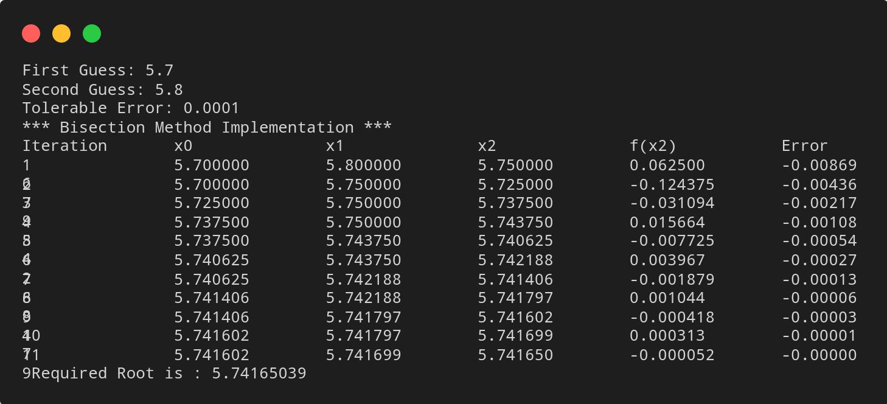

# Bisection Method

## Algorithm

    1. Start

    2. Define function f(x)

    3. Choose initial guesses x0 and x1 such that f(x0)f(x1) < 0

    4. Choose pre-specified tolerable error e.

    5. Calculate new approximated root as x2 = (x0 + x1)/2

    6. Calculate f(x0)f(x2)
	    a. If f(x0)f(x2) < 0 then x0 = x0 and x1 = x2
	    b. If f(x0)f(x2) > 0 then x0 = x2 and x1 = x1
	    c. If f(x0)f(x2) = 0 then goto (8)
	
    7. If |f(x2)| > e then goto (5) otherwise goto (8)

    8. Display x2 as root.

    9. Stop

## Source Code

``` python 
# Defining equation
def f(x):
    return x**2-4*x-10

# Implementing Bisection method
def bisection(x0,x1,e):
    step = 1
    print("\n\n*** Bisection Method Implementation ***")
    condition = True
    print('Iteration\tx0\t\tx1\t\tx2\t\tf(x2)\t\tError')
    while condition:
        x2 = (x0 + x1)/2
        err = (x2 - x1)/x2
        print('%d\t\t%0.6f\t%0.6f\t%0.6f\t%0.6f\t%0.6f'%(step, x0, x1,x2, f(x2), err))

        if f(x0) * f(x2) < 0:
            x1 = x2
        else:
            x0 = x2

        step += 1
        condition = abs(f(x2)) > e
    
    print("\n Required Root is : %0.8f" % x2)

# Input Section
x0 = float(input('First Guess: '))
x1 = float(input('Second Guess: '))
e = float(input('Tolerable Error: '))

# Checking correctness of initial guess values and bisecting
if f(x0) * f(x1) > 0.0:
    print('Given guess values do not bracket the root.\nTry again with different guess values')
else:
    bisection(x0,x1,e)
```

## Output



## Link

[Bisection Method](https://github.com/kabirdeula/Numerical_Method_Lab_Report/blob/main/Lab%20Report/Lab01.py)

[Back to Home](../README.md)
