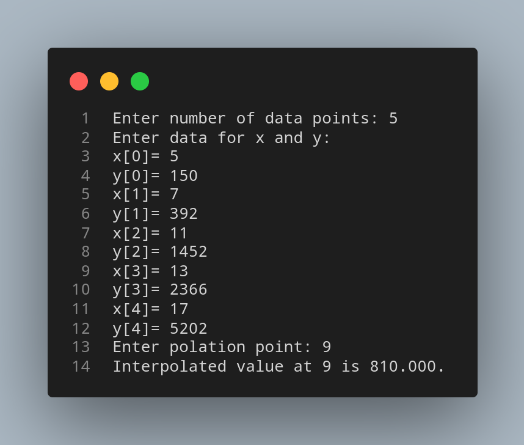

# Lagrange Interpolation Method

## Algorithm

    1. Start

    2. Read number of data (n)

    3. Read data X<sub>i</sub> and Y<sub>i</sub> for i = 1 to n

    4. Read value of independent variables say xp whose corresponding value of dependent say yp is to be determined.

    5. Initialize: yp = 0

    6. For i = 1 to n
        Set p = 1
        For j = 1 to n
            If i != j then
                Calculate p = p * (xp - X<sub>j</sub>)/(X<sub>i</sub> - X<sub>j</sub>)
            End if
        Next j
        Calculate yp = yp + p * Y<sub>i</sub>
       Next i
    
    7. Display value of yp as interpolated value.

    8. Stop

## Source Code

``` python
# Importing NumPy Library
import numpy as np

# Reading number of unknowns
n = int(input('Enter number of data points: '))

# Making numpy array of n & n x n size and initializing 
# to zero for storing x and y value along with difference of y
x = np.zeros((n))
y = np.zeros((n))

# Reading data points
print('Enter data for x and y: ')
for i in range(n):
  x[i] = float(input( 'x['+str(i)+']='))
  y[i] = float(input( 'y['+str(i)+']='))

# Reading interpolation point 
xp = float(input('Enter polation point: '))

# Set interpolated value initially to zero
yp = 0

# Implementing Lagrange Interpolation
for i in range(n):
  p = 1
  for j in range(n):
    if i != j:
      p = p*(xp - x[j])/(x[i] - x[j])
    
  yp = yp +p * y[i]

# Displaying output
print('Interpolated value at %.3f is %.3f.'%(xp,yp))
```

## Output



## Link

[Lagrange Interpolation Method](https://github.com/kabirdeula/Numerical_Method_Lab_Report/blob/main/Lab%20Report/Lab05.py)

[Back to Home](../README.md)
