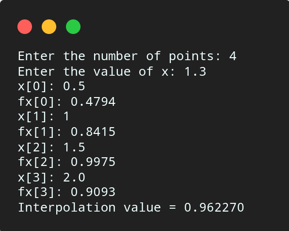

# Newton Divided Difference

## Algorithm

    1. Start.

    2. Read number of points, say n.

    3. Read the value at which interpolated value is needed, say x.

    4. Read given data points.

    5. Calculate First divided difference as,
        For i = 0 to n - 1
            dd[i] = fx[i]
            End For
    
    6. Calculate second to nth divided difference as,
        For i = 0 to n - 1
            For j = n - 1 to i + 1
                dd[j] = (dd[j] - dd[j - 1])/(x[j] - x[j -1 - i])
            End For
        End For
    
    7. Set v = 0 and p = 1

    8. Calculated interpolated value as,
        For i = 0 to n - 1
            For j = 0 to i - 1
                p = p * ( x - x1)
            End For
            v = v + dd[i] * p
            Reset p = 1
        End For
    
    9. Print the interpolated value v.

    10. Stop

## Source Code

``` c

#include<stdio.h>

int main(){
    int n, i, j;
    float v = 0, p, xv, x[10], fx[10], a[10];
    printf("Enter the number of points: ");
    scanf("%d", &n);
    printf("Enter the value of x: ");
    scanf("%f",&xv);
    for(i = 0; i < n; i++){
        printf("x[%d]: ",i);
        scanf("%f", &x[i]);
        printf("fx[%d]: ",i);
        scanf("%f", &fx[i]);
    }
    for(i = 0; i < n; i++){
        a[i] = fx[i];
    }
    for(i = 0; i < n; i++){
        for(j = n - 1; j > i; j --){
            a[j] = (a[j] - a[j - 1])/(x[j] - x[j - 1 - i]);
        }
    }
    v = 0;
    for(i = 0; i < n; i++){
        p = 1;
        for(j = 0; j <= i-1; j++){
            p = p * (xv - x[j]);
        }
        v =  v + a[i] * p;
    }
    printf("Interpolation value = %f\n",v);
}
```

## Output



## Link

[Newton's Divided Difference](https://github.com/kabirdeula/Numerical_Method_Lab_Report/blob/main/Lab%20Report/Lab06.c)

[Back to Home](../README.md)
