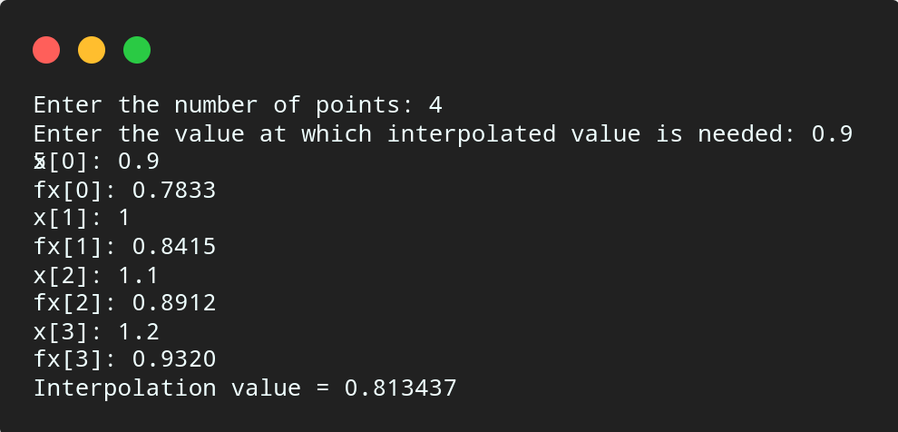

# Newton Forward Difference

## Algorithm

    1. Start

    2. Read number of data points, say n.

    3. Read the value at which interpolated value is needed, say xp.

    4. Read n data points, say x[i] and fx[i].

    5. Set h = x[1] - x[0] and s = (xp - x[0]) / h.

    6. Calculate first forward difference as below,

        For i = 0 to n - 1
            fd[i] = fx[i]
        End for

    7. Calculate second to nth forward difference as below,
        
        For i = 0 to n - 1
            For j = n - 1 to i + 1
                fd[j] = fd[j] - fd[j - 1]
            End For
        End For

    8. Set v = fd[0] and Set p = 1.

    9. Calculat interpolated value as below,

        For i = 1 to n - 1
            For k = 1 to i
                p = p * (s - k + 1)
            End For
            v = v + (fd[i] * p) / i!
            Reset p = 1
        End For
    
    10. Print the interpolated value v at xp.

    11. Terminate.

## Source Code

``` c

#include<stdio.h>

int fact(int n){

    if(n == 1){
        return 1;
    }else{
        return (n * fact(n - 1));
    }
}

int main(){

    int n, i, j, k;
    float v = 0, p, xp, x[10], fx[10], fd[10], h, s;
    
    printf("Enter the number of points: ");
    scanf("%d", &n);
    
    printf("Enter the value at which interpolated value is needed: ");
    scanf("%f", &xp);
    
    for (i = 0; i < n; i++){
        printf("x[%d]: ",i);
        scanf("%f", &x[i]);
        printf("fx[%d]: ",i);
        scanf("%f",&fx[i]);
    }

    h = x[1] - x[0];
    s = (xp - x[0]) / h;

    for (i = 0; i < n; i++){
        fd[i] = fx[i];
    }

    for (i = 0; i < n; i++){
        for (j = n - 1; j > i; j--){
            fd[j] = (fd[j] - fd[j - 1]);
        }
    }
    v = fd[0];

    for (i = 1; i < n; i++){
        p = 1;
        for (k = 1; k <= i; k++){
            p = p * (s - k + 1);
        }
        v = v + (fd[i] * p) / fact(i);
    }

    printf("Interpolation value = %f\n", v);
    return 0;

}

```

## Output



## Link

[Newton's Forward Difference](https://github.com/kabirdeula/Numerical_Method_Lab_Report/blob/main/Lab%20Report/Lab07.c)

[Back to Home](../README.md)
