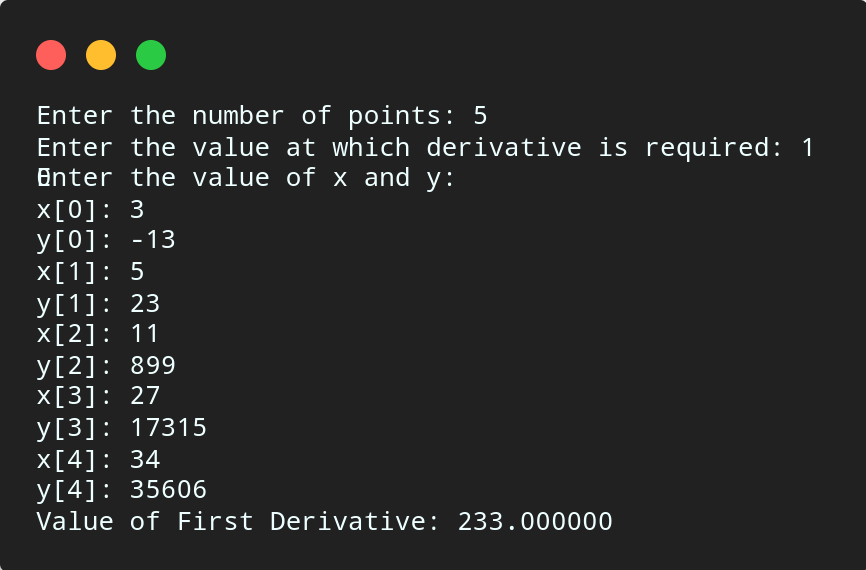

# Differenciation using Newton divided Difference

## Algorithm

    1. Start

    2. Read number of points, say n.

    3. Read n data points.

    4. Read the value at which derivative is needed, say x.

    5. Compute divided differences as below,

        For i = 0 to n - 1
            dd[i] = fx[i]
        End For

        For i = 0 to n - 1
            For j = n - 1 to i + 1
                dd[j] = (dd[j] - dd[j - 1]) / (x[i] - x[j - 1 - i])
            End For
        End For
    
    6. Computed differentiated values as below,

        Set v = dd[1]
        For i = 2 to n - 1
            term = 0
            For j = 0 to i
                factor = 1
                For k = 0 to i
                    If(j != k)
                        factor = factor * (x - x[k])
                End For
            term += factor
            End For
            vod += dd[i]
        End For

    7. Print the value of first derivative, which is value of variable v.

    8. Terminate

## Source Code

```c

#include<stdio.h>

int main(){

    int n, i, j, k;
    float factor, term, vod, xv, x[10], y[10], a[10];

    printf("Enter the number of points: ");
    scanf("%d", &n);

    printf("Enter the value at which derivative is required: ");
    scanf("%f", &xv);

    printf("Enter the value of x and y:\n");
    for (i = 0; i < n; i++){
        printf("x[%d]: ",i);
        scanf("%f", &x[i]);
        printf("y[%d]: ",i);
        scanf("%f",&y[i]);
    }

    // Calculating divided difference
    for (i = 0; i < n; i++){
        a[i] = y[i];
    }
    for (i = 0; i < n; i++){
        for (j = n - 1; j > i; j--){
            a[j] = (a[j] - a[j - 1]) / (x[j] - x[j - 1 - i]);
        }
    }

    // Calculating value of derative
    vod = a[1];
    for (i = 2; i < n; i++){
        term = 0;
        for (j = 0; j < i; j++){
            factor = 1;
            for (k = 0; k < i; k++){
                if (k != j){
                    factor = factor * (xv - x[k]);
                }
            }
            term += factor;
        }
        vod = vod + (a[i] * term);
    }

    printf("Value of First Derivative: %f\n", vod);
    return 0;
}

```

## Output



## Links

[Differentiation using Newton Divided Difference](https://github.com/kabirdeula/Numerical_Method_Lab_Report/blob/main/Lab%20Report/Lab12.c)

[Back to Home](../README.md)
