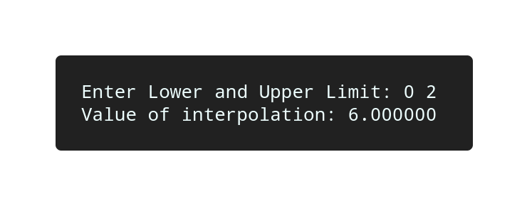

# Trapezoidal

## Algorithm

    1. Start

    2. Raed value of lower and upper limit, say x0 and x1.

    3. Calculate values f(x0) and f(x1).

    4. Calculate h = (x1 - x0).

    5. Calculate the value of integration by using formula.

    6. Display the value of integratin "v".

    7. Terminate.

## Source Code

```c

#include<stdio.h>
#include<math.h>

#define f(x) x+2

int main(){
    
    float h, x0, x1, fx0, fx1, v;

    printf("Enter Lower and Upper Limit: ");
    scanf("%f%f", &x0, &x1);

    h = x1 - x0;
    fx0 = f(x0);
    fx1 = f(x1);
    v = h / 2 * (fx0 + fx1);

    printf("Value of interpolation: %f\n", v);
    return 0;
}

```

## Output



## Links

[Trapezoidal Rule](https://github.com/kabirdeula/Numerical_Method_Lab_Report/blob/main/Lab%20Report/Lab13.c)

[Back to Home](../README.md)
