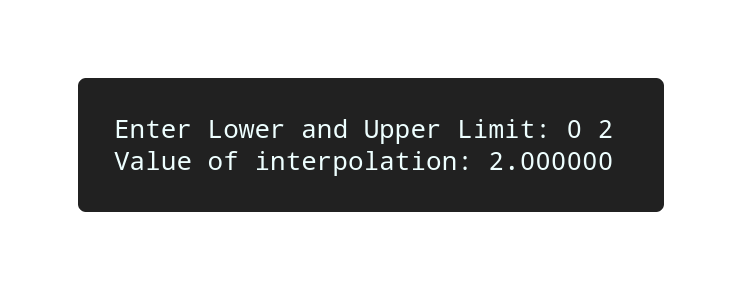

# Simpson 1/3 Rule

## Algorithm

    1. Start

    2. Raed value of lower and upper limit, say x0 and x2.

    3. Set n = 2.

    4. h = (x2 - x0) / n.

    5. x1 = x0 + h.

    6. Calculate values f(x0), f(x1) and f(x2).

    7. Calculate the value of integration by using formula.

    8. Display the value of integratin "v".

    9. Terminate.

## Source Code

```c
#include<stdio.h>

#define f(x) 3*(x)*(x) + 2*(x)-5

int main(){
    
    float h, x0, x1, x2, fx0, fx1, fx2, v;
    int n = 2;

    printf("Enter Lower and Upper Limit: ");
    scanf("%f%f", &x0, &x2);

    h = (x2 - x0) / n;
    x1 = x0 + h;
    fx0 = f(x0);
    fx1 = f(x1);
    fx2 = f(x2);
    v = h / 3 * (fx0 + 4 * fx1 + fx2);

    printf("Value of interpolation: %f\n", v);
    return 0;
}

```

## Output



## Links

[Simpson 1/3 Rule](https://github.com/kabirdeula/Numerical_Method_Lab_Report/blob/main/Lab%20Report/Lab14.c)

[Back to Home](../README.md)
