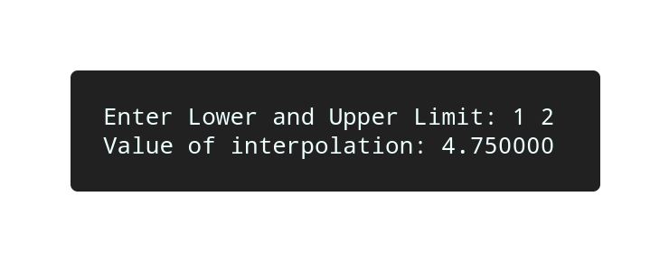

# Simpson 3/8 Rule

## Algorithm

    1. Start

    2. Raed value of lower and upper limit, say x0 and x3.

    3. Set n = 3.

    4. h = (x3 - x0) / n.

    5. x1 = x0 + h
       x2 = x0 + 2h.

    6. Calculate values f(x0), f(x1), f(x2) and f(x3).

    7. Calculate the value of integration by using formula.

    8. Display the value of integratin "v".

    9. Terminate.

## Source Code

```c
#include<stdio.h>
#include<math.h>
#define f(x) (x)*(x)*(x) + 1

int main(){
    
    float h, x0, x1, x2, x3, fx0, fx1, fx2, fx3, v;
    int n = 3;

    printf("Enter Lower and Upper Limit: ");
    scanf("%f%f", &x0, &x3);

    h = (x3 - x0) / n;
    x1 = x0 + h;
    x2 = x0 + 2 * h;
    fx0 = f(x0);
    fx1 = f(x1);
    fx2 = f(x2);
    fx3 = f(x3);
    v = 3 / 8.0 * h * (fx0 + 3 * fx1 + 3 * fx2 + fx3);

    printf("Value of interpolation: %f\n", v);
    return 0;
}

```

## Output



## Links

[Simpson 3/8 Rule](https://github.com/kabirdeula/Numerical_Method_Lab_Report/blob/main/Lab%20Report/Lab15.c)

[Back to Home](../README.md)
