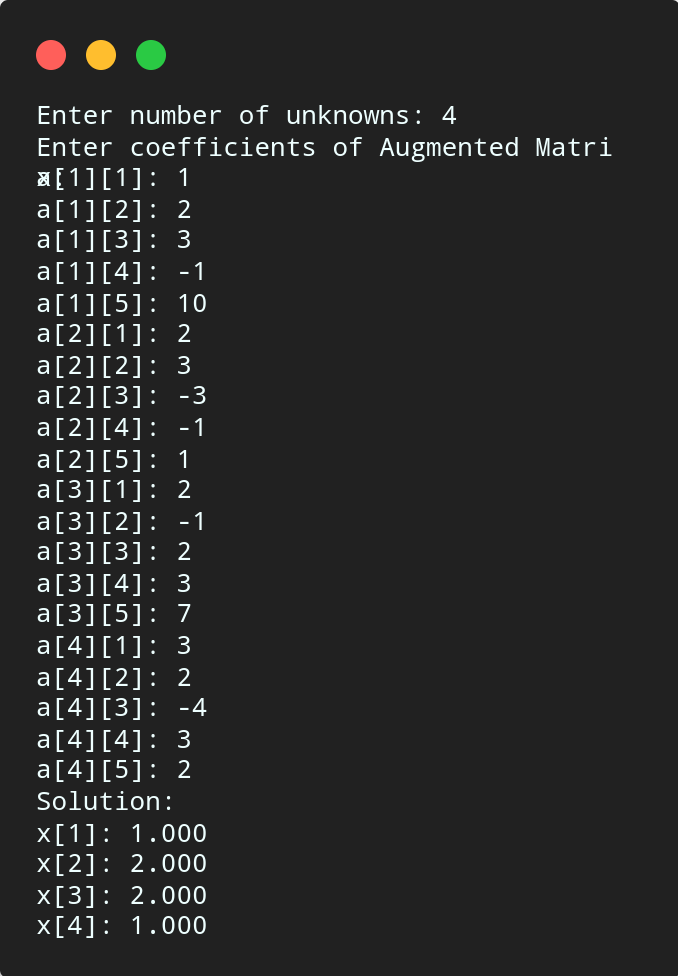

# Gauss Jordan

## Algorithm

    1. Start

    2. Read Number of Unknowns: n

    3. Read Augmented Matrix (A) of n by n + 1 size.

    4. Transform Augmented Matrix (A) to Diagonal Matrix by Row Operations.

    5. Obtain Soluntion by Making All Diagonal Elements to 1.

    6. Display Result.

    7. Stop.

## Source Code

``` c
#include<stdio.h>
#include<math.h>
#include<stdlib.h>

#define SIZE 10

int main(){

    float a[SIZE][SIZE], x[SIZE],ratio;
    int i, j, k, n;

    printf("Enter number of unknowns: ");
    scanf("%d", &n);

    printf("Enter coefficients of Augmented Matrix:\n");
    for (i = 1; i <= n; i++){
        for (j = 1; j <= n + 1; j++){
            printf("a[%d][%d]: ", i, j);
            scanf("%f", &a[i][j]);
        }
    }

    for (i = 1; i <= n; i++){
        if ( a[i][i] == 0.0){
            printf("Mathematical Error!");
            exit(0);
        }
        for (j = 1; j <= n; j++){
            if (i != j){
                ratio = a[j][i] / a[i][i];
                for (k = 1; k <= n + 1; k++){
                    a[j][k] = a[j][k] - ratio * a[i][k];
                }
            }
        }
    }

    for (i = 1; i <= n; i++){
        x[i] = a[i][n + 1] / a[i][i];
    }

    printf("\nSolution:\n");
    for (i = 1; i <= n; i++){
        printf("x[%d]: %0.3f\n", i, x[i]);
    }
    
    return 0;
}
```

## Output



## Links

[Gauss Jordan Method](https://github.com/kabirdeula/Numerical_Method_Lab_Report/blob/main/Lab%20Report/Lab16.c)

[Back to Home](../README.md)
